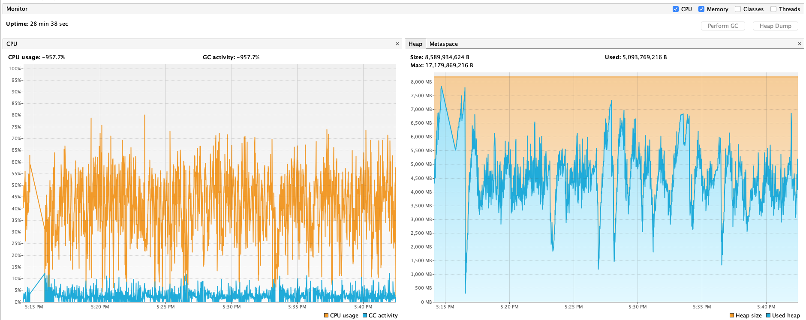
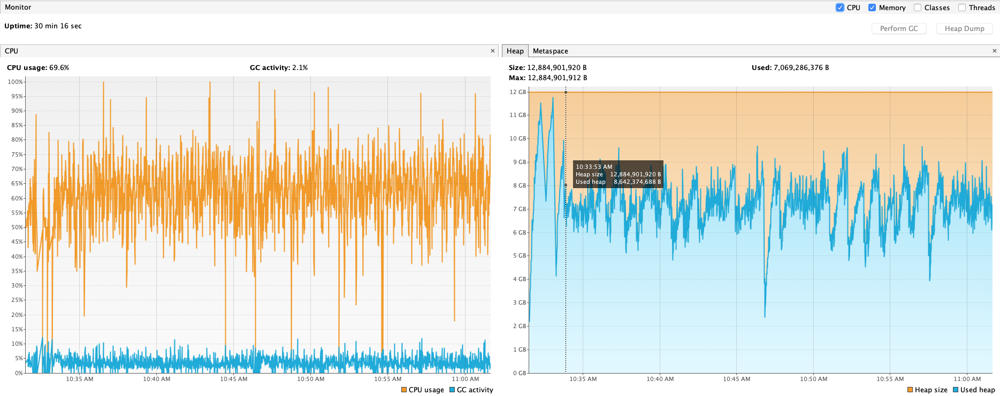
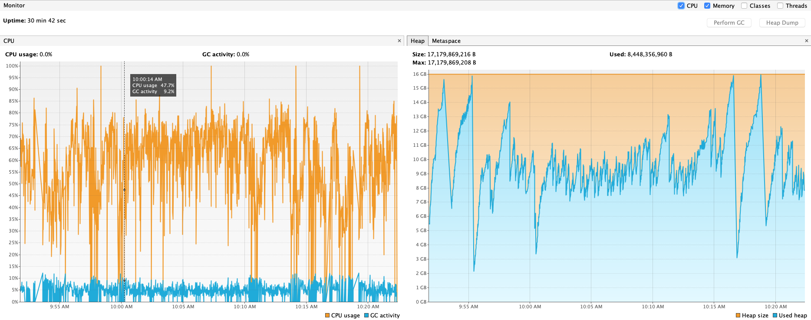

# Otel Tace Raw Benchmarks

This package contains benchmarks for the otel-trace-raw-prepper using JMH: https://openjdk.java.net/projects/code-tools/jmh/ . 

Integration with gradle is done with the following gradle plugin for JMH: https://github.com/melix/jmh-gradle-plugin.

The plugin creates a source set for the JMH benchmarks, and provides a few gradle tasks for running and building the benchmarks.

## Running the tests via gradle task

Tests can be run via the "jmh" gradle task provided by the plugin. The README for the plugin provides the various parameters that
can be provided to the plugin. 

## Running the tests via JAR

To run the tests via JAR, you can build the benchmark jar using the gradle task "shadowJar". This jar is an executable jar 
that runs the benchmark tests. Example command:

```
java -jar otel-trace-raw-benchmarks-0.1-beta-jmh.jar -r 600 -i 2 -p batchSize=100
```

The above command will run the benchmarks for 600 seconds (10 minutes) per iteration, 2 iterations. It also
sets the batchSize and windowDurationSeconds benchmark parameters. 

## Results
### Single Thread
#### Throughput
```
java -jar build/libs/otel-trace-raw-benchmarks-0.1-beta-all.jar -r 300 -wi 2 -w 100 -i 5 -p batchSize=10 -p concurrencyScale=1 -jvmArgsPrepend -Xmx8g -jvmArgsPrepend -Xms8g
WARNING: An illegal reflective access operation has occurred
WARNING: Illegal reflective access by org.openjdk.jmh.util.Utils (file:/Users/qchea/IdeaProjects/simple-ingest-transformation-utility-pipeline/data-prepper-benchmarks/otel-trace-raw-benchmarks/build/libs/otel-trace-raw-benchmarks-0.1-beta-all.jar) to field java.io.Console.cs
WARNING: Please consider reporting this to the maintainers of org.openjdk.jmh.util.Utils
WARNING: Use --illegal-access=warn to enable warnings of further illegal reflective access operations
WARNING: All illegal access operations will be denied in a future release
# JMH version: 1.25
# VM version: JDK 14.0.1, OpenJDK 64-Bit Server VM, 14.0.1+7
# VM invoker: /Users/qchea/Library/Java/JavaVirtualMachines/openjdk-14.0.1/Contents/Home/bin/java
# VM options: -Xmx8g -Xms8g
# Warmup: 2 iterations, 100 s each
# Measurement: 5 iterations, 300 s each
# Timeout: 10 min per iteration
# Threads: 1 thread, will synchronize iterations
# Benchmark mode: Throughput, ops/time
# Benchmark: com.amazon.dataprepper.benchmarks.prepper.OtelTraceRawPrepperBenchmarks.benchmarkExecute
# Parameters: (batchSize = 10, concurrencyScale = 1)

# Run progress: 0.00% complete, ETA 00:28:20
# Fork: 1 of 1
# Warmup Iteration   1: WARNING: sun.reflect.Reflection.getCallerClass is not supported. This will impact performance.
6674.550 ops/s
# Warmup Iteration   2: 8611.630 ops/s
Iteration   1: 12578.281 ops/s
Iteration   2: 11230.512 ops/s
Iteration   3: 11543.572 ops/s
Iteration   4: 9943.793 ops/s
Iteration   5: 11426.910 ops/s


Result "com.amazon.dataprepper.benchmarks.prepper.OtelTraceRawPrepperBenchmarks.benchmarkExecute":
  11344.614 ±(99.9%) 3624.319 ops/s [Average]
  (min, avg, max) = (9943.793, 11344.614, 12578.281), stdev = 941.224
  CI (99.9%): [7720.295, 14968.932] (assumes normal distribution)


# Run complete. Total time: 00:28:39

REMEMBER: The numbers below are just data. To gain reusable insights, you need to follow up on
why the numbers are the way they are. Use profilers (see -prof, -lprof), design factorial
experiments, perform baseline and negative tests that provide experimental control, make sure
the benchmarking environment is safe on JVM/OS/HW level, ask for reviews from the domain experts.
Do not assume the numbers tell you what you want them to tell.

Benchmark                                       (batchSize)  (concurrencyScale)   Mode  Cnt      Score      Error  Units
OtelTraceRawPrepperBenchmarks.benchmarkExecute           10                   1  thrpt    5  11344.614 ± 3624.319  ops/s
```
#### CPU and JVM heap



### 2-thread

#### Throughput

```
java -jar build/libs/otel-trace-raw-benchmarks-0.1-beta-all.jar -r 300 -wi 3 -w 100 -i 5 -t 2 -p batchSize=10 -p concurrencyScale=2 -jvmArgsPrepend -Xmx12g -jvmArgsPrepend -Xms12g
WARNING: An illegal reflective access operation has occurred
WARNING: Illegal reflective access by org.openjdk.jmh.util.Utils (file:/Users/qchea/IdeaProjects/simple-ingest-transformation-utility-pipeline/data-prepper-benchmarks/otel-trace-raw-benchmarks/build/libs/otel-trace-raw-benchmarks-0.1-beta-all.jar) to field java.io.Console.cs
WARNING: Please consider reporting this to the maintainers of org.openjdk.jmh.util.Utils
WARNING: Use --illegal-access=warn to enable warnings of further illegal reflective access operations
WARNING: All illegal access operations will be denied in a future release
# JMH version: 1.25
# VM version: JDK 14.0.1, OpenJDK 64-Bit Server VM, 14.0.1+7
# VM invoker: /Users/qchea/Library/Java/JavaVirtualMachines/openjdk-14.0.1/Contents/Home/bin/java
# VM options: -Xmx12g -Xms12g
# Warmup: 3 iterations, 100 s each
# Measurement: 5 iterations, 300 s each
# Timeout: 10 min per iteration
# Threads: 2 threads, will synchronize iterations
# Benchmark mode: Throughput, ops/time
# Benchmark: com.amazon.dataprepper.benchmarks.prepper.OtelTraceRawPrepperBenchmarks.benchmarkExecute
# Parameters: (batchSize = 10, concurrencyScale = 2)

# Run progress: 0.00% complete, ETA 00:30:00
# Fork: 1 of 1
# Warmup Iteration   1: WARNING: sun.reflect.Reflection.getCallerClass is not supported. This will impact performance.
11056.045 ops/s
# Warmup Iteration   2: 20605.420 ops/s
# Warmup Iteration   3: 20446.280 ops/s
Iteration   1: 20032.075 ops/s
Iteration   2: 19550.460 ops/s
Iteration   3: 21418.426 ops/s
Iteration   4: 19507.215 ops/s
Iteration   5: 20176.240 ops/s


Result "com.amazon.dataprepper.benchmarks.prepper.OtelTraceRawPrepperBenchmarks.benchmarkExecute":
  20136.883 ±(99.9%) 2979.750 ops/s [Average]
  (min, avg, max) = (19507.215, 20136.883, 21418.426), stdev = 773.832
  CI (99.9%): [17157.133, 23116.633] (assumes normal distribution)


# Run complete. Total time: 00:30:18

REMEMBER: The numbers below are just data. To gain reusable insights, you need to follow up on
why the numbers are the way they are. Use profilers (see -prof, -lprof), design factorial
experiments, perform baseline and negative tests that provide experimental control, make sure
the benchmarking environment is safe on JVM/OS/HW level, ask for reviews from the domain experts.
Do not assume the numbers tell you what you want them to tell.

Benchmark                                       (batchSize)  (concurrencyScale)   Mode  Cnt      Score      Error  Units
OtelTraceRawPrepperBenchmarks.benchmarkExecute           10                   2  thrpt    5  20136.883 ± 2979.750  ops/s
```

#### CPU and JVM Heap Memory



### 4-thread

#### Throughput

```
 java -jar build/libs/otel-trace-raw-benchmarks-0.1-beta-all.jar -r 300 -wi 3 -w 100 -i 5 -t 4 -p batchSize=10 -p concurrencyScale=4 -jvmArgsPrepend -Xmx16g -jvmArgsPrepend -Xms16g
WARNING: An illegal reflective access operation has occurred
WARNING: Illegal reflective access by org.openjdk.jmh.util.Utils (file:/Users/qchea/IdeaProjects/simple-ingest-transformation-utility-pipeline/data-prepper-benchmarks/otel-trace-raw-benchmarks/build/libs/otel-trace-raw-benchmarks-0.1-beta-all.jar) to field java.io.Console.cs
WARNING: Please consider reporting this to the maintainers of org.openjdk.jmh.util.Utils
WARNING: Use --illegal-access=warn to enable warnings of further illegal reflective access operations
WARNING: All illegal access operations will be denied in a future release
# JMH version: 1.25
# VM version: JDK 14.0.1, OpenJDK 64-Bit Server VM, 14.0.1+7
# VM invoker: /Users/qchea/Library/Java/JavaVirtualMachines/openjdk-14.0.1/Contents/Home/bin/java
# VM options: -Xmx16g -Xms16g
# Warmup: 3 iterations, 100 s each
# Measurement: 5 iterations, 300 s each
# Timeout: 10 min per iteration
# Threads: 4 threads, will synchronize iterations
# Benchmark mode: Throughput, ops/time
# Benchmark: com.amazon.dataprepper.benchmarks.prepper.OtelTraceRawPrepperBenchmarks.benchmarkExecute
# Parameters: (batchSize = 10, concurrencyScale = 4)

# Run progress: 0.00% complete, ETA 00:30:00
# Fork: 1 of 1
# Warmup Iteration   1: WARNING: sun.reflect.Reflection.getCallerClass is not supported. This will impact performance.
9324.379 ops/s
# Warmup Iteration   2: 9786.658 ops/s
# Warmup Iteration   3: 19816.265 ops/s
Iteration   1: 13045.227 ops/s
Iteration   2: 16374.335 ops/s
Iteration   3: 15036.150 ops/s
Iteration   4: 11452.566 ops/s
Iteration   5: 10941.196 ops/s
<JMH had finished, but forked VM did not exit, are there stray running threads? Waiting 24 seconds more...>

Non-finished threads:

Thread[DestroyJavaVM,5,main]


Result "com.amazon.dataprepper.benchmarks.prepper.OtelTraceRawPrepperBenchmarks.benchmarkExecute":
  13369.895 ±(99.9%) 8923.864 ops/s [Average]
  (min, avg, max) = (10941.196, 13369.895, 16374.335), stdev = 2317.499
  CI (99.9%): [4446.031, 22293.758] (assumes normal distribution)


# Run complete. Total time: 00:30:49

REMEMBER: The numbers below are just data. To gain reusable insights, you need to follow up on
why the numbers are the way they are. Use profilers (see -prof, -lprof), design factorial
experiments, perform baseline and negative tests that provide experimental control, make sure
the benchmarking environment is safe on JVM/OS/HW level, ask for reviews from the domain experts.
Do not assume the numbers tell you what you want them to tell.

Benchmark                                       (batchSize)  (concurrencyScale)   Mode  Cnt      Score      Error  Units
OtelTraceRawPrepperBenchmarks.benchmarkExecute           10                   4  thrpt    5  13369.895 ± 8923.864  ops/s
```

#### CPU and JVM 


